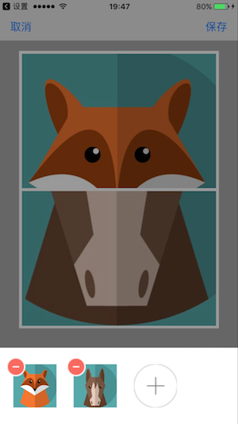
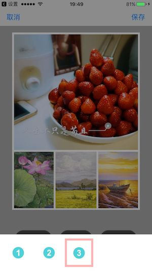
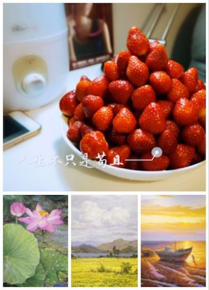

## Stitcher

这是一个美图秀秀中拼图模块的简单实现，[有兴趣的同学可以参考看看][1]

[视频效果][2]

编辑中的图

拼接生成的图：

  [1]: https://github.com/xglofter/Stitcher
  [2]: http://v.youku.com/v_show/id_XMjgwMDQxMjY5Ng==.html?spm=a2hzp.8253869.0.0